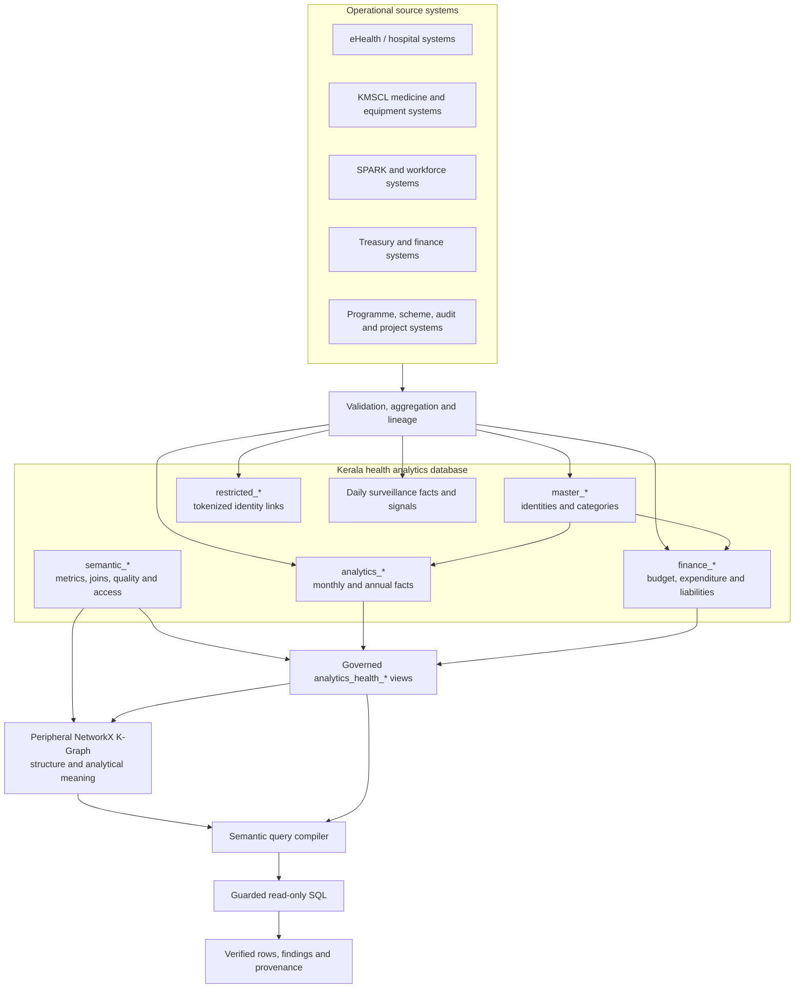
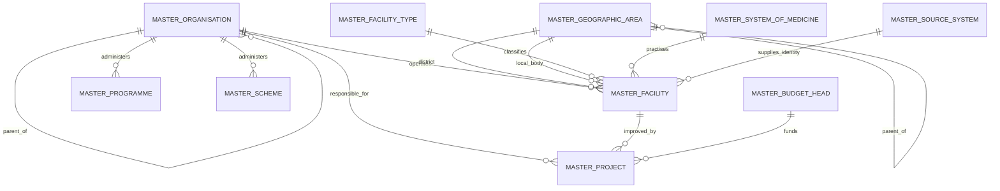
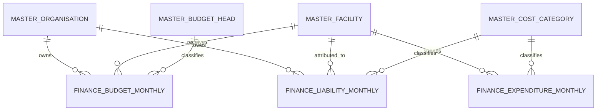
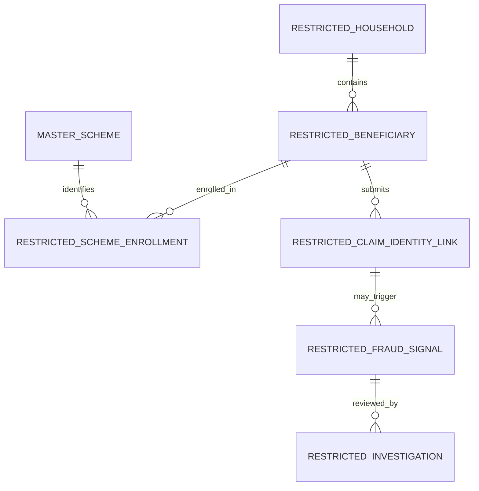
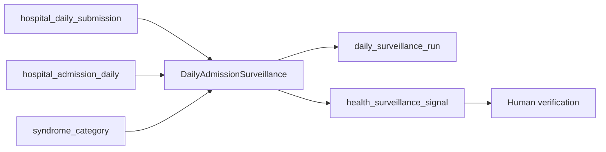
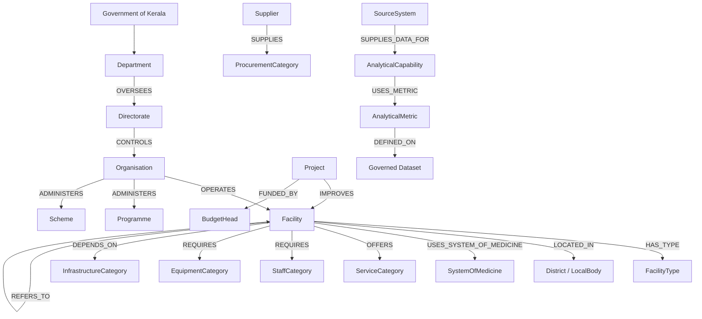
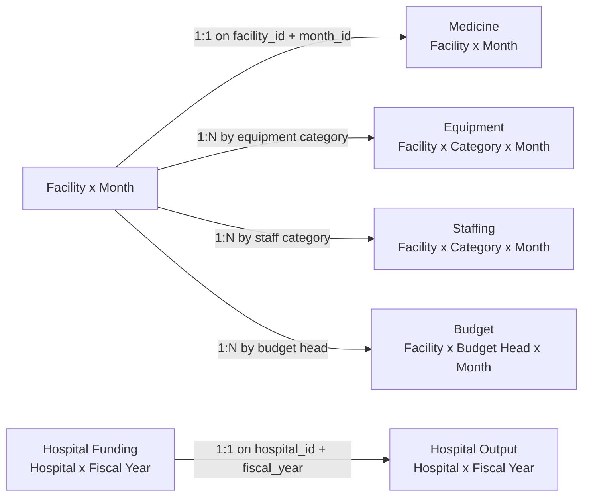
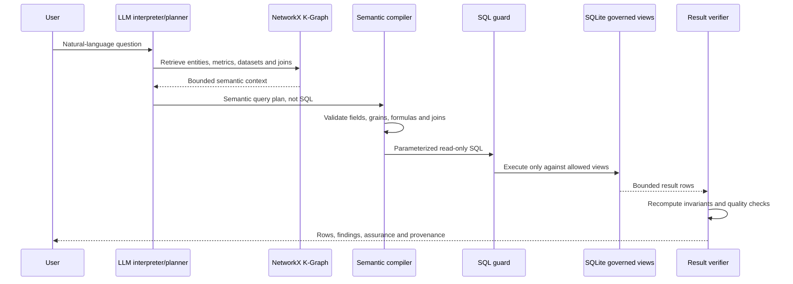

# Kerala Health Department Database and K-Graph Architecture

Status: current implementation  
Architecture version: `health-ministry-analytics-2026-07-23.1`
Last updated: 23 July 2026

## 1. Purpose

This document describes the health module as it currently exists in the
repository. It covers:

- the facility-centred ministry analytics database;
- the daily health-surveillance and legacy compatibility structures;
- governed analytical views and metric definitions;
- the restricted beneficiary layer;
- the peripheral NetworkX knowledge graph;
- the relationship between relational data, semantic metadata, and safe query
  execution.

The platform is an analytical system. It does not replace hospital EMRs,
inventory systems, payroll, procurement applications, treasury systems, or
programme-management applications. Those systems retain operational detail and
send validated aggregates with source lineage to the ministry model.

## 2. Sources of truth

| Concern | Source file |
|---|---|
| Canonical ministry schema | `sql/ministry_analytics_schema.sql` |
| Canonical demonstration data | `sql/ministry_analytics_seed.sql` |
| Compatibility and surveillance schema | `sql/schema.sql` |
| Compatibility demonstration data | `sql/demo_seed.sql` |
| Ministry K-Graph metadata | `ministry_graph.py` |
| Combined health graph definition | `graph_definition.py` |
| Daily surveillance logic | `surveillance.py` |
| Ministry bootstrap registration | `../registry.py` |

Database initialization executes the global audit schema followed by the four
health scripts in this order:

```text
storage/sql/schema.sql
  -> health/sql/schema.sql
  -> health/sql/ministry_analytics_schema.sql
  -> health/sql/demo_seed.sql
  -> health/sql/ministry_analytics_seed.sql
```

The SQLite database currently contains 70 tables and 17 governed or
compatibility views after initialization. The health K-Graph definition
contains 52 semantic entities, 17 datasets, 26 metrics, 130 semantic
relationships, 112 aliases, 28 dataset links, and 5 approved dataset joins.

## 3. High-level architecture



## 4. Database layers

SQLite does not provide PostgreSQL-style schemas. The design therefore uses
table prefixes to express logical namespaces.

| Logical namespace | SQLite prefix | Responsibility |
|---|---|---|
| `master` | `master_` | Shared identities, hierarchies, dimensions and source systems |
| `analytics` | `analytics_` | Aggregate service, resource, programme and governance facts |
| `finance` | `finance_` | Budget, expenditure and liability facts |
| `restricted` | `restricted_` | Purpose-limited tokenized beneficiary and investigation links |
| `semantic` | `semantic_` | Metric, dimension, capability, join, quality and access definitions |
| governed views | `analytics_health_` | Read-only analytical interfaces registered in the K-Graph |

The global `audit_execution` table is outside the health namespace. It records
question hashes, interpreted specifications, compiled SQL, execution status,
row counts, provider identity, and query provenance.

## 5. Master-data architecture

`master_facility` is the central entity. Hospitals, health centres, teaching
institutions, specialty institutes, AYUSH facilities, autonomous institutions,
and participating private providers use the same identity model.



### 5.1 Identity and hierarchy tables

| Table | Purpose |
|---|---|
| `master_source_system` | Source owner, steward, refresh frequency and active status |
| `master_calendar` | Calendar month, financial year and financial quarter |
| `master_geographic_area` | Effective-dated state, district, taluk, block, local-body, ward and catchment hierarchy |
| `master_organisation` | Department, directorate, mission, corporation, regulator, agency or institution hierarchy |
| `master_facility_type` | Governed facility type, level, teaching capability and specialty status |
| `master_system_of_medicine` | Modern Medicine, Ayurveda, Homoeopathy, Siddha, Unani, Yoga, Naturopathy or Mixed |
| `master_facility` | Common facility identity, ownership, location, medicine system, teaching status, beds and operating status |

Organisation and facility records are effective-dated. Facts use stable integer
keys, while human-readable codes remain unique business identifiers.

`organisation_type` and `administrative_level` use controlled vocabularies.
Organisation graph edges are selected from those classifications and the
parent key: a `DEPARTMENT` oversees a same-level `DIRECTORATE`, while a
`DIRECTORATE` controls typed organisations within its administrative scope.
Tree depth by itself never selects `OVERSEES` or `CONTROLS`.

Cross-table triggers enforce facility geography. `district_id` must identify a
`DISTRICT`; `local_body_id`, when present, must identify a `LOCAL_BODY` whose
direct parent is that same district. Reverse-protection triggers prevent later
geography edits from invalidating those assignments.

Facility type is authoritative for teaching capability. A facility may be
`TEACHING` or `AFFILIATED` only when its type has `teaching_capable = 1`, and a
type cannot lose that capability while such a facility uses it.

### 5.2 Analytical-category tables

| Table | Classification |
|---|---|
| `master_cost_category` | Salary, medicines, maintenance, capital works and other costs |
| `master_staff_category` | Doctors, nurses, pharmacists, public-health staff and other workforce groups |
| `master_equipment_category` | Equipment categories with routine, important or critical classification |
| `master_service_category` | Primary, emergency, inpatient, surgical, diagnostic, maternal and other services |
| `master_infrastructure_category` | Electricity, oxygen, water, connectivity and other dependencies |
| `master_procurement_category` | Medicine, equipment, maintenance, IT and other procurement groups |
| `master_vehicle_category` | Emergency ambulance, patient transport, mobile medical unit and other vehicles |
| `master_quality_category` | Patient safety, infection control, readiness and citizen experience |
| `master_demographic_group` | Aggregate age, sex, disability, socioeconomic, tribal, coastal or migrant equity dimensions |

### 5.3 Programme and commercial master tables

| Table | Purpose |
|---|---|
| `master_programme` | Public-health programme and administering organisation |
| `master_scheme` | Welfare or insurance scheme and administering organisation |
| `master_supplier` | Supplier or contractor identity and classification |
| `master_budget_head` | Hierarchical budget classification and fund source |
| `master_project` | Capital or digital project, responsible organisation, facility and budget source |

## 6. Aggregate fact architecture

Primary keys enforce the declared grain. Foreign keys enforce conformed master
data. Counts and monetary amounts cannot be negative, percentages are bounded,
and controlled statuses use `CHECK` constraints.

| Table | Enforced grain | Main measures |
|---|---|---|
| `analytics_facility_monthly_summary` | Facility x Month | Visits, admissions, surgeries, deliveries, tests, referrals, beds, staff, budget, expenditure, waiting, grievances, deaths |
| `analytics_medicine_monthly` | Facility x Month | Stock value, required value, consumption, losses, emergency purchases, stockout days, critical incidents and delays |
| `analytics_equipment_monthly` | Facility x Equipment Category x Month | Required, available and functional counts, procurement value, maintenance, downtime and utilisation |
| `analytics_staffing_monthly` | Facility x Staff Category x Month | Required, sanctioned, filled and available staff, employment type, overtime, training and cost |
| `analytics_service_monthly` | Facility x Service Category x Demographic Group x Month | Capacity, demand, delivery, waiting, resource support, referrals and unmet demand |
| `analytics_referral_flow_monthly` | Source Facility x Destination Facility x Service Category x Month | Referral disposition, transfer time, distance, ambulance use and main resource gap |
| `analytics_procurement_monthly` | Organisation x Facility x Supplier x Procurement Category x Month | Requested, approved, ordered, received and paid values, delays, rejection and emergency purchase |
| `analytics_supplier_performance_monthly` | Supplier x Procurement Category x Month | Contract performance, delivery, rejection, payment and risk score |
| `analytics_infrastructure_monthly` | Facility x Infrastructure Category x Month | Required, available and functional capacity, cost, downtime and inspection issues |
| `analytics_vehicle_monthly` | Facility x Station x Vehicle Category x Month | Availability, trips, distance, transported patients, cost, downtime and response time |
| `analytics_programme_monthly` | Programme x District x Demographic Group x Month | Population target, eligibility, reach, services, finance, activity and outcome value |
| `analytics_scheme_monthly` | Scheme x District x Demographic Group x Month | Enrolment, service, claims, payments, duplicates and fraud signals |
| `analytics_medical_college_annual` | Teaching Institution x Academic Year | Seats, students, faculty, beds, activity, research, finance and accreditation |
| `analytics_quality_monthly` | Facility x Quality Category x Month | Inspections, issues, incidents, complaints, compliance and quality score |
| `analytics_audit_issue` | Audit Issue | Organisation/facility, category, financial value, severity and resolution |
| `analytics_project_monthly` | Project x Month | Cost, release, spending, progress, completion, delay and risk |
| `analytics_data_quality_monthly` | Source System x Organisation x Month | Expected, received, valid and rejected records, failure rates, freshness and quality score |

Aggregate demographic groups were added to service, programme and scheme facts
so equity can be analysed without placing person records in the general
analytical environment.

## 7. Finance architecture



| Table | Grain | Purpose |
|---|---|---|
| `finance_budget_monthly` | Organisation x optional Facility x Budget Head x Month | Budget, releases, availability, commitments, expenditure, liabilities and delays |
| `finance_expenditure_monthly` | Facility x Cost Category x Month | Budget, commitment, expenditure, outstanding amount and prior-year comparison |
| `finance_liability_monthly` | Organisation x optional Facility x Cost Category x Month | Opening, incurred, paid, closing and overdue liabilities |

SQLite permits `NULL` within a composite rowid-table primary key. Unique
expression indexes normalize a missing facility to scope `-1`, ensuring only
one organisation-wide fact exists at a given grain.

## 8. Restricted identity architecture

The normal analytical database and K-Graph contain no person nodes or direct
identifiers. The restricted tables use externally generated tokens.



| Table | Purpose |
|---|---|
| `restricted_household` | Tokenized household, district, retention date and tokenization version |
| `restricted_beneficiary` | Tokenized beneficiary, household link and aggregate demographic classification |
| `restricted_scheme_enrollment` | Purpose-limited eligibility and enrolment link |
| `restricted_claim_identity_link` | Tokenized claim-to-beneficiary, scheme and facility link |
| `restricted_fraud_signal` | Risk signal requiring review; not a finding of fraud |
| `restricted_investigation` | Authorized investigation workflow and outcome |

These tables are intentionally absent from the governed dataset catalog and
the general K-Graph. Production deployment should isolate them physically or
enforce database-level restricted roles in addition to application policy.

## 9. Semantic governance architecture

| Table | Responsibility |
|---|---|
| `semantic_metric_definition` | Formula, aggregation, unit, owner, privacy class, minimum quality and version |
| `semantic_dimension_definition` | Approved dimension source, key and label |
| `semantic_capability` | Purpose, output grain, privacy, quality threshold and limitations |
| `semantic_capability_input` | Required dataset, metric, dimension or filter inputs |
| `semantic_allowed_join` | Approved join keys, cardinality and status |
| `semantic_quality_rule` | Dataset rule, severity and failure action |
| `semantic_access_policy` | Role, resource, row-filter and purpose limitation |

`semantic_access_policy.permitted_role` stores identifiers from the deployment
IAM or directory service. Role lifecycle and membership are intentionally
external; there is no duplicate role table in this analytical database.

Facts store the components of ratios rather than duplicate calculated rates.
Governed views calculate rates in one place and return `NULL` for a zero
denominator. This prevents conflicting versions of the same KPI.

## 10. Governed analytical views

The query engine can read governed views registered in the K-Graph. It cannot
read arbitrary raw or restricted tables.

### 10.1 Canonical ministry views

| View | Grain | Important derived measures |
|---|---|---|
| `analytics_health_facility_monthly` | Facility x Month | Bed occupancy, staff sufficiency and budget utilisation |
| `analytics_health_medicine_monthly` | Facility x Month | Medicine sufficiency and expiry loss |
| `analytics_health_equipment_monthly` | Facility x Equipment Category x Month | Equipment sufficiency, functionality and maintenance-cost ratio |
| `analytics_health_staffing_monthly` | Facility x Staff Category x Month | Staff sufficiency and vacancy |
| `analytics_health_service_monthly` | Facility x Service Category x Demographic Group x Month | Service utilisation and unmet demand |
| `analytics_health_budget_monthly` | Organisation or Facility x Budget Head x Month | Budget utilisation and payment/release delays |
| `analytics_health_programme_monthly` | Programme x District x Demographic Group x Month | Coverage and cost per person reached |
| `analytics_health_scheme_monthly` | Scheme x District x Demographic Group x Month | Coverage and claim approval |
| `analytics_health_data_quality_monthly` | Source System x Organisation x Month | Quality score, volume and freshness |

### 10.2 Compatibility and surveillance views

| View | Grain | Purpose |
|---|---|---|
| `analytics_health_hospital_funding_year` | Hospital x Fiscal Year x Funding Category | Earlier operating-funding pilot |
| `analytics_health_hospital_output_year` | Hospital x Fiscal Year | Earlier activity-output pilot |
| `analytics_health_hospital_equipment` | Equipment Asset | Asset-level demonstration |
| `analytics_health_hospital_care_level` | Hospital x Effective Classification | Current seven-level care classification |
| `analytics_health_facility_referral_route` | From Level x To Level x Route Type | Governed referral hierarchy |
| `analytics_health_district_referral_pyramid` | District x Care Level x Profile | Approximate planning profile |
| `analytics_health_admission_daily` | Hospital x Patient District x Date x Syndrome x Age Band | Aggregate daily surveillance input |
| `analytics_health_surveillance_signal` | Run x Geography x Syndrome | Anomaly signal requiring human verification |

## 11. Daily surveillance subsystem

Monthly ministry marts are not fast enough for early-warning surveillance. The
health module therefore retains a separate daily path.



The detector evaluates one closed reporting date only after the configured
submission-completeness threshold passes. It compares the date with the prior
eight matching weekdays at hospital, patient-residence district and statewide
levels. Signals are `WATCH` or `HIGH`, always start as `NEEDS_REVIEW`, and never
constitute an automated outbreak declaration.

## 12. Peripheral K-Graph architecture

The K-Graph describes structure, ownership, dependencies, analytical meaning,
approved datasets and joins. It does not duplicate monthly measurements.

### 12.1 Core semantic topology



### 12.2 Graph node kinds

The NetworkX property graph uses these node kinds:

- `RegistryMetadata`: ministry registry version;
- `SemanticEntity`: organisation, facility, category and analytical concepts;
- `SemanticDataset`: governed relational view and declared grain;
- `SemanticField`: approved view fields and their semantic roles;
- `SemanticMetric`: formula, aggregation, unit and valid transforms;
- `SemanticAlias`: natural-language term mapped to an entity or metric.

Edges use:

- `SEMANTIC_RELATION` for domain relationships;
- `HAS_FIELD` for dataset fields;
- `DEFINED_ON` for metric-to-dataset ownership;
- `AVAILABLE_IN` for entity/metric-to-dataset discovery;
- `DATASET_JOIN` for approved relational joins;
- `ALIASES` for natural-language vocabulary.

### 12.3 Main K-Graph entities

The ministry redesign registers:

```text
Department              Directorate             Organisation
GeographicArea          District                LocalBody
Facility                FacilityType            SystemOfMedicine
ServiceCategory         StaffCategory           EquipmentCategory
InfrastructureCategory CostCategory             ProcurementCategory
Programme               Scheme                  Supplier
BudgetHead              Project                 QualityIndicator
DemographicGroup        SourceSystem            AnalyticalMetric
AnalyticalCapability
```

The graph also retains compatibility entities for hospitals, equipment assets,
syndromes, surveillance signals, the seven facility levels, and Kerala's 14
district nodes. `Hospital IS_A Facility` makes the migration boundary explicit.

Person, beneficiary, prescription, medicine-batch, employee-attendance,
financial-transaction and monthly-value nodes are prohibited from the general
graph.

## 13. Relational-to-K-Graph mapping

| Relational source | K-Graph entity or relationship |
|---|---|
| `master_organisation.parent_organisation_id` | Department `OVERSEES` Directorate; Directorate `CONTROLS` Organisation |
| `master_facility.parent_organisation_id` | Organisation `OPERATES` Facility |
| `master_facility.facility_type_id` | Facility `HAS_TYPE` FacilityType |
| `master_facility.district_id` | Facility `LOCATED_IN` District |
| `master_facility.local_body_id` | Facility `LOCATED_IN` LocalBody |
| `master_facility.system_of_medicine_id` | Facility `USES_SYSTEM_OF_MEDICINE` SystemOfMedicine |
| `analytics_service_monthly` | Facility `OFFERS` ServiceCategory |
| `analytics_staffing_monthly` | Facility `REQUIRES` StaffCategory |
| `analytics_equipment_monthly` | Facility `REQUIRES` EquipmentCategory |
| `analytics_infrastructure_monthly` | Facility `DEPENDS_ON` InfrastructureCategory |
| `analytics_referral_flow_monthly` | Facility `REFERS_TO` Facility |
| `master_programme.administering_organisation_id` | Organisation `ADMINISTERS` Programme |
| `master_scheme.administering_organisation_id` | Organisation `ADMINISTERS` Scheme |
| `analytics_programme_monthly` | Programme `TARGETS` District and DemographicGroup |
| `finance_budget_monthly` | Facility `FUNDED_BY` BudgetHead |
| `finance_expenditure_monthly` | Facility `SPENDS_ON` CostCategory |
| `analytics_supplier_performance_monthly` | Supplier `SUPPLIES` ProcurementCategory |
| `analytics_procurement_monthly` | Supplier `CONTRACTED_BY` Organisation |
| `master_project` | Project `IMPROVES` Facility and `FUNDED_BY` BudgetHead |
| `semantic_metric_definition` | AnalyticalMetric metadata |
| `semantic_capability_input` | AnalyticalCapability `USES_METRIC` AnalyticalMetric |

Relationships based on facts mean that the relationship type is registered in
the graph while numeric monthly evidence remains in SQL.

## 14. Registered ministry metrics

| Metric | Governed dataset | Formula or aggregation |
|---|---|---|
| `monthly_outpatient_visits` | `analytics_health_facility_monthly` | Sum of outpatient visits |
| `bed_occupancy_percentage` | `analytics_health_facility_monthly` | Occupied bed-days / available bed-days |
| `medicine_sufficiency_percentage` | `analytics_health_medicine_monthly` | Available stock value / required stock value |
| `critical_stockout_incidents` | `analytics_health_medicine_monthly` | Sum of critical incidents |
| `equipment_functionality_percentage` | `analytics_health_equipment_monthly` | Functional / available equipment |
| `monthly_equipment_downtime` | `analytics_health_equipment_monthly` | Sum of downtime hours |
| `staffing_sufficiency_percentage` | `analytics_health_staffing_monthly` | Actually available / required staff |
| `estimated_unmet_service_demand` | `analytics_health_service_monthly` | Sum of estimated unmet demand |
| `monthly_budget_utilisation_percentage` | `analytics_health_budget_monthly` | Actual expenditure / available funds |
| `programme_coverage_percentage` | `analytics_health_programme_monthly` | Population reached / eligible population |
| `scheme_coverage_percentage` | `analytics_health_scheme_monthly` | Enrolled / eligible individuals |
| `claim_approval_percentage` | `analytics_health_scheme_monthly` | Approved / submitted claims |
| `ministry_data_quality_score` | `analytics_health_data_quality_monthly` | Average governed quality score |

Compatibility metrics for annual hospital funding/output, equipment assets,
care levels, referral hierarchy and daily surveillance remain registered.

## 15. Approved dataset joins



One-to-many joins are safe only when the category remains in the result grain
or the category dataset is aggregated before joining. The cardinality metadata
exists specifically to prevent silent multiplication of facility totals.

The narrow allow-list is deliberate. Service, infrastructure and vehicle facts
carry extra service, demographic, infrastructure, station or vehicle
dimensions and are excluded until a governed pre-aggregation rule preserves
their grain. Programme and scheme facts are district-grain rather than
facility-grain, so they are not valid facility-month joins merely because they
share a month. New joins require explicit grain review and registry approval.

## 16. Governed query execution



The LLM cannot invent joins or formulas outside retrieved graph context. The
compiler produces SQL from approved metadata, the SQLite authorizer blocks
mutation and raw-table bypass, results are row-limited, and execution metadata
is written to `audit_execution`.

## 17. Compatibility and migration state

The original pilot structures remain because the current test suite,
surveillance service and demonstration query adapter use them:

```text
district
hospital
healthcare_facility_level
healthcare_referral_route
hospital_facility_classification
district_facility_distribution_profile
hospital_funding
hospital_output
hospital_equipment
syndrome_category
hospital_daily_submission
hospital_admission_daily
daily_surveillance_run
health_surveillance_signal
```

`hospital` is a mutable compatibility identity rather than a history table, so
its unused `effective_from` and `effective_to` columns were removed.
Classification history remains in `hospital_facility_classification`, with a
partial unique index ensuring at most one current row per hospital.

The nullable, unique `hospital.master_facility_id` foreign key is the migration
bridge to `master_facility`. The three demonstration hospitals are reconciled
through it, and compatibility governed views expose the key. New compatibility
rows may remain null only while reconciliation is pending; production cutover
must backfill it and make the mapping mandatory. This bridge enables an
explicit path for surveillance-to-resourcing work without assuming that legacy
and canonical integer identifiers are interchangeable.

New source integrations should target the canonical prefixed tables. The
compatibility structures can be retired after:

1. every hospital has a reconciled `master_facility_id` and the column is made
   mandatory;
2. annual pilot queries use monthly governed marts or an approved annual view;
3. surveillance references the common facility identity;
4. synthetic fixtures and all callers have migrated;
5. a versioned data migration and rollback procedure has been tested.

## 18. Current limitations and production requirements

The architecture is implemented and tested, but the seed data is illustrative.
Production readiness still requires:

- authoritative organisation, facility, geography and category reconciliation;
- signed source-to-target mappings for eHealth, KMSCL, SPARK, finance, NHM,
  SHA, AYUSH, audit, regulatory and project systems;
- metric-owner approval for required-resource norms and programme outcomes;
- lower-grain governed drill-down for critical medicines and equipment;
- period-close, late-arriving-data and revision policies;
- physical isolation or database roles for restricted data;
- encryption, retention enforcement, audit monitoring and small-cell
  suppression;
- source freshness SLAs, reconciliation checks and operational alerting;
- performance validation on expected production volumes.

## 19. Comprehensive synthetic test data

`comprehensive_synthetic.py` supplements the legacy hospital seeder. Run both
through the existing CLI:

```bash
python -m kgraph_llm --db var/kerala_demo.db seed --rows-per-table 2000
```

The command upgrades an older local database schema without requiring a reset,
then creates exactly 2,000 deterministic rows in each designated
high-cardinality master, analytical, finance, restricted-token and daily
surveillance table. Natural reference data retains realistic cardinality—for
example, Kerala remains 14 districts rather than 2,000 invented districts.

The seeder finishes with three mandatory checks:

- every application table contains data;
- every column has at least one non-`NULL` value;
- every designated high-cardinality table contains exactly the requested row
  count.

It also preserves foreign-key integrity. All generated facility names,
suppliers, projects, beneficiary tokens, household tokens, claims, signals and
audit records are explicitly synthetic and must never be treated as Kerala
Government records.

## 20. Verification

The architecture is covered by `tests/test_health_ministry_model.py` and the
existing pipeline and surveillance tests. The tests verify:

- creation of all five logical database layers;
- referential integrity with `PRAGMA foreign_key_check`;
- centrally derived ratios and zero-denominator behavior;
- privacy, quality and allowed-join metadata;
- presence of ministry entities and relationships in the K-Graph;
- absence of beneficiary/person entities and restricted datasets from the
  general K-Graph;
- declared grains and category-safe join cardinalities;
- compatibility with the existing semantic query and surveillance pipeline.
